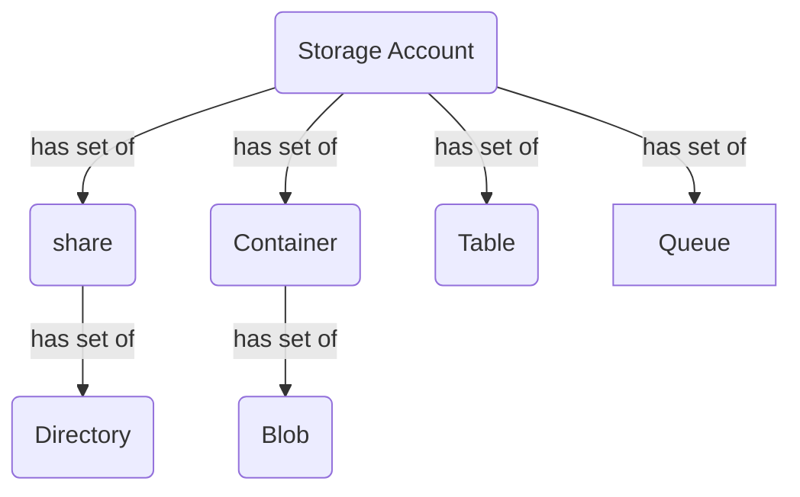

# Storage Account

This module represents a tree of storage resources under a storage account.  It will create a storage account and optionally provision associated storage resources.  Examples of these resources are: custom domain, network rules, blob and queue properties, identities, websites, containers, blobs, shares, directories, tables and queues.
<br />


<br />

## Technical Hardening Requirements (THRs)

Technical Hardening Requirements can be found on Confluence; [Storage Account Technical Hardening Standards](https://core-ets.atlassian.net/wiki/spaces/EC/pages/12469141556/Storage+Account+Technical+Hardening+Standards).

<br />

## File Structure
```bash
./
├── README.md                     # provides information about all variables declared in the storage_account module
├── storage_account_main.tf       # contains the main structure of the module
├── storage_account_outputs.tf    # contains all exported variables (outputs)
├── storage_account_vars.tf       # contains all variable declarations (inputs)
├──── storage_account_blob
│     └── example_storage_account_blob.tf                     # a deployment of a storage account with a blobs
├──── storage_account_encryption
│     └── example_storage_account_encryption_kvmod_role.tf    # a deployment of a storage account with encryption of data-at-rest
├──── storage_account_gen2fs
│     └── example_storage_account_gen2fs.tf                   # a deployment of a storage account with Gen2FS Data Lake
├──── storage_account_lifecycle
│     └── example_storage_account_lifecycle.tf                # a deployment of a storage account with lifecycle policies
├──── storage_account_minimal
│     └── example_storage_account_minimal.tf                  # a minimal deployment of a storage account (only)
├──── storage_account_private_endpoint
│     └── example_storage_account_private_endpoint.tf         # a deployment of a storage account with private endpoints
├──── storage_account_queue
│     └── example_storage_account_queue.tf                    # a deployment of a storage account with queue
├──── storage_account_rbac
│     └── example_storage_rbac.tf                             # a deployment of a storage account with role based access assignment
├──── storage_account_share
│     └── example_storage_account_share.tf                    # a deployment of a storage account with file shares
├──── storage_account_table
│     └── example_storage_account_table.tf                    # a deployment of a storage account with tables
└──── tests
      └──── unit_test
            └── storage_account_test.go                       # unit test for the module
```
<br />

<!-- BEGIN_TF_DOCS -->
## Providers

| Name | Version |
|------|---------|
| azurerm | >= 3.0.0 |

## Modules

| Name | Source | Version |
|------|--------|---------|
| azuread_recommended_provider_version | ../../../tools/required_providers/v1/azuread | n/a |
| azurerm_recommended_provider_version | ../../../tools/required_providers/v1/azurerm | n/a |
| common_resource_tags | ../../../tools/resource_tags/v1 | n/a |
| default_firewall | ../../../tools/default_network_firewall/v1/ | n/a |
| private_endpoint | ../../../networking/private_endpoint/v1 | n/a |
| role_assignments | ../../../common/role_assignment/v1 | n/a |
| storage_monitor_diagnostic | ../../../management_tools/monitor_diagnostic/v1 | n/a |

## Resources

| Name | Type |
|------|------|
| [azurerm_storage_account.storage_account](https://registry.terraform.io/providers/hashicorp/azurerm/latest/docs/resources/storage_account) | resource |
| [azurerm_storage_account_customer_managed_key.storage_encryption](https://registry.terraform.io/providers/hashicorp/azurerm/latest/docs/resources/storage_account_customer_managed_key) | resource |
| [azurerm_storage_blob.blob_storage](https://registry.terraform.io/providers/hashicorp/azurerm/latest/docs/resources/storage_blob) | resource |
| [azurerm_storage_blob_inventory_policy.blob_inventory_policy](https://registry.terraform.io/providers/hashicorp/azurerm/latest/docs/resources/storage_blob_inventory_policy) | resource |
| [azurerm_storage_container.blob_container](https://registry.terraform.io/providers/hashicorp/azurerm/latest/docs/resources/storage_container) | resource |
| [azurerm_storage_data_lake_gen2_filesystem.gen2_filesystem](https://registry.terraform.io/providers/hashicorp/azurerm/latest/docs/resources/storage_data_lake_gen2_filesystem) | resource |
| [azurerm_storage_data_lake_gen2_path.gen2_path](https://registry.terraform.io/providers/hashicorp/azurerm/latest/docs/resources/storage_data_lake_gen2_path) | resource |
| [azurerm_storage_management_policy.management_policy](https://registry.terraform.io/providers/hashicorp/azurerm/latest/docs/resources/storage_management_policy) | resource |
| [azurerm_storage_queue.storage_queue](https://registry.terraform.io/providers/hashicorp/azurerm/latest/docs/resources/storage_queue) | resource |
| [azurerm_storage_share.storage_share](https://registry.terraform.io/providers/hashicorp/azurerm/latest/docs/resources/storage_share) | resource |
| [azurerm_storage_share_directory.storage_share_directory](https://registry.terraform.io/providers/hashicorp/azurerm/latest/docs/resources/storage_share_directory) | resource |
| [azurerm_storage_sync.storage_sync](https://registry.terraform.io/providers/hashicorp/azurerm/latest/docs/resources/storage_sync) | resource |
| [azurerm_storage_sync_cloud_endpoint.sync_cloud_endpoint](https://registry.terraform.io/providers/hashicorp/azurerm/latest/docs/resources/storage_sync_cloud_endpoint) | resource |
| [azurerm_storage_sync_group.sync_group](https://registry.terraform.io/providers/hashicorp/azurerm/latest/docs/resources/storage_sync_group) | resource |
| [azurerm_storage_table.storage_table](https://registry.terraform.io/providers/hashicorp/azurerm/latest/docs/resources/storage_table) | resource |

## Inputs

| Name | Description | Type | Default | Required |
|------|-------------|------|---------|:--------:|
| account_replication_type | Defines the type of replication to use for this storage account. Valid options are `LRS`, `GRS`, `RAGRS`, `ZRS`, `GZRS` and `RAGZRS`. Changing this forces a new resource to be created when types `LRS`, `GRS` and `RAGRS` are changed to `ZRS`, `GZRS` or `RAGZRS` and vice versa. | `string` | n/a | yes |
| account_tier | Defines the Tier to use for this storage account. Valid options are `Standard` and `Premium`. For `BlockBlobStorage` and `FileStorage` accounts only the `Premium` tier is valid. Changing this forces a new resource to be created. | `string` | n/a | yes |
| location | The location to provision this resource in. | `string` | n/a | yes |
| name | The name of the storage acount. | `string` | n/a | yes |
| resource_group_name | The name of the resource group to provision this resource in. | `string` | n/a | yes |
| access_tier | Defines the access tier for `BlobStorage`, `FileStorage` and `StorageV2` accounts. Valid options are `Hot` and `Cool`, defaults to `Hot`. | `string` | `null` | no |
| account_kind | Defines the Kind of account. Valid options are `BlobStorage`, `BlockBlobStorage`, `FileStorage`, `Storage` and `StorageV2`. Changing this forces a new resource to be created. Defaults to `StorageV2`. | `string` | `null` | no |
| adls_gen2 | A list of ADLS Gen2 filesystems. | `any` | `[]` | no |
| allow_nested_items_to_be_public | Allow or disallow public access to all nested items in the storage account. Defaults to true. | `bool` | `null` | no |
| azure_files_authentication | Azure Files supports identity-based authentication with on-prem AD or Azure AD see [this link](https://docs.microsoft.com/en-us/azure/storage/files/storage-files-active-directory-overview) for details. | `any` | `{}` | no |
| blob_properties | A blob_properties block. | `any` | `{}` | no |
| containers | A list of storage blob containers. | `any` | `[]` | no |
| cross_tenant_replication_enabled | Should cross Tenant replication be enabled? Defaults to true. | `bool` | `null` | no |
| custom_domain | A custom_domain block. | `any` | `{}` | no |
| custom_tags | A map of custom tags to apply to the resource. Combined with `environment_variables`. Overridden by `tags`. | `any` | `{}` | no |
| customer_managed_key | A customer_managed_key block. | `any` | `{}` | no |
| default_to_oauth_authentication | Default to Azure Active Directory authorization in the Azure portal when accessing the Storage Account. The default value is false | `bool` | `null` | no |
| diagnostic_settings | [Diagnostic settings](#diagnostic-settings) are used to configure streaming export of platform logs and metrics for a resource to the destination of your choice. Please refer to the [monitor diagnostic module](../../../management_tools/monitor_diagnostic/v1/README.md). | `any` | `[]` | no |
| edge_zone | Specifies the Edge Zone within the Azure Region where this Storage Account should exist. Changing this forces a new Storage Account to be created. | `any` | `null` | no |
| enable_https_traffic_only | Only allow HTTPs traffic? | `bool` | `true` | no |
| enable_zscaler_lookup | (Optional) Perform lookup against zScaler API for current firewall? Defaults to false | `bool` | `false` | no |
| encryption_type | Set to `CustomManaged` to use your own Azure Key Vault id, key name, key version and user assigned identity id. | `string` | `null` | no |
| environment_variables | A map of environment variables to apply to the resource. Combined with `custom_tags`. Overridden by `tags`. Please refer to the [environment variables module](../../../tools/environment_variables/v1/README.md). | `any` | `{}` | no |
| identity | An identity block. | `any` | `{}` | no |
| infrastructure_encryption_enabled | Is infrastructure encryption enabled? | `bool` | `null` | no |
| is_hns_enabled | Is Hierarchical Namespace enabled? Defaults to `false`. If set to `true` then `account_tier` must be `Standard`. | `bool` | `null` | no |
| key_name | The name of the encryption key. Used when encryption_type set to `CustomManaged`. | `string` | `null` | no |
| key_vault_id | The id of the Azure Key Vault containing the encryption key. Used when encryption_type set to `CustomManaged`. | `string` | `null` | no |
| key_version | The version of the encryption key. Used when encryption_type set to `CustomManaged`. | `string` | `null` | no |
| large_file_share_enabled | Is Large File Share Enabled? | `bool` | `null` | no |
| lifecycle_rules | A list of lifecycle management rules for storage account. | `any` | `[]` | no |
| min_tls_version | The minimum supported TLS version for the storage account. Possible values are `TLS1_0`, `TLS1_1`, and `TLS1_2`. Defaults to `TLS1_2` for new storage accounts. | `string` | `"TLS1_2"` | no |
| network_rules | A network_rules block. | `any` | `{}` | no |
| nfsv3_enabled | Is NFSv3 protocol enabled? This can only be true when account_tier is Standard and account_kind is StorageV2, or account_tier is Premium and account_kind is BlockBlobStorage. Additionally, the is_hns_enabled is true, and enable_https_traffic_only is false. | `bool` | `null` | no |
| private_endpoints | A list of the [private endpoints](#private-endpoints). Please refer to the [private endpoint module](../../../networking/private_endpoint/v1/README.md). | `any` | `[]` | no |
| properties | A mapping of Key to Base64-Encoded Values which should be assigned to this Data Lake Gen2 File System. | `any` | `{}` | no |
| public_network_access_enabled | Whether the public network access is enabled? Defaults to true. | `bool` | `null` | no |
| queue_encryption_key_type | The encryption type of the queue service. Possible values are Service and Account. Changing this forces a new resource to be created. Default value is Service. | `any` | `null` | no |
| queue_properties | A queue_properties block. | `any` | `{}` | no |
| queues | A list of storage queues. | `any` | `[]` | no |
| role_assignments | [Role assignments](#role-assignments) to grant to this resource. Refer to the [role assignment module](../../../common/role_assignment/v1/README.md) for details or to [Microsoft Docs](https://docs.microsoft.com/en-us/azure/purview/catalog-permissions#who-should-be-assigned-to-what-role). | `any` | `{}` | no |
| routing | Can be `InternetRouting` or `MicrosoftRouting`. Internet routing directs traffic to enter the Microsoft cloud closer to the Azure Storage endpoint. Microsoft routing directs traffic to enter the Microsoft cloud closer to the requesting client. | `any` | `{}` | no |
| share_properties | A share_properties block. | `any` | `{}` | no |
| shared_access_key_enabled | Indicates whether the storage account permits requests to be authorized with the account access key via Shared Key. If false, then all requests, including shared access signatures, must be authorized with Azure Active Directory (Azure AD). The default value is true. | `bool` | `null` | no |
| shares | A list of storage file share directories. | `any` | `[]` | no |
| static_website | A static_website block. | `any` | `{}` | no |
| table_encryption_key_type | The encryption type of the table service. Possible values are Service and Account. Changing this forces a new resource to be created. Default value is Service. | `any` | `null` | no |
| tables | A list of storage tables. | `any` | `[]` | no |
| tags | A mapping of tags to assign to this resource. | `map(string)` | `{}` | no |
| user_assigned_identity_id | The ID of a user assigned identity, used when encryption_type set to `CustomManaged`. | `string` | `null` | no |

## Outputs

| Name | Description |
|------|-------------|
| account_replication_type | n/a |
| blobs | blob |
| containers | container and blobs |
| diagnostics | n/a |
| directories | ddirectories shares |
| flattened_data | n/a |
| gen2_filesystem | container and blobs |
| id | n/a |
| identity | n/a |
| name | storage account The ID of the Storage Account. |
| primary_access_key | The primary access key for the storage account |
| primary_blob_connection_string | The connection string associated with the primary blob location |
| primary_blob_endpoint | The endpoint URL for blob storage in the primary location. |
| primary_blob_host | The hostname with port if applicable for blob storage in the primary location. |
| primary_connection_string | The connection string associated with the primary location |
| primary_dfs_endpoint | The endpoint URL for DFS storage in the primary location |
| primary_dfs_host | The hostname with port if applicable for DFS storage in the primary location. |
| primary_file_endpoint | The endpoint URL for file storage in the primary location |
| primary_file_host | The hostname with port if applicable for file storage in the primary location. |
| primary_location | The primary location of the storage account. |
| primary_queue_endpoint | The endpoint URL for queue storage in the primary locatio |
| primary_queue_host | The hostname with port if applicable for queue storage in the primary location |
| primary_table_endpoint | The endpoint URL for table storage in the primary location |
| primary_table_host | The hostname with port if applicable for table storage in the primary location |
| primary_web_endpoint | The endpoint URL for web storage in the primary location. |
| primary_web_host | The hostname with port if applicable for web storage in the primary location |
| queues | queue |
| role_assignment | n/a |
| secondary_access_key | The secondary access key for the storage account |
| secondary_blob_connection_string | The connection string associated with the secondary blob location. |
| secondary_blob_endpoint | The endpoint URL for blob storage in the secondary location. |
| secondary_blob_host | The hostname with port if applicable for blob storage in the secondary location. |
| secondary_connection_string | The connection string associated with the secondary location |
| secondary_dfs_endpoint | The endpoint URL for DFS storage in the secondary location. |
| secondary_dfs_host | The hostname with port if applicable for DFS storage in the secondary location |
| secondary_file_endpoint | The endpoint URL for file storage in the secondary location |
| secondary_file_host | The hostname with port if applicable for file storage in the secondary location |
| secondary_location | The secondary location of the storage account. |
| secondary_queue_endpoint | The endpoint URL for queue storage in the secondary location. |
| secondary_queue_host | The hostname with port if applicable for queue storage in the secondary location. |
| secondary_table_endpoint | The endpoint URL for table storage in the secondary location. |
| secondary_table_host | The hostname with port if applicable for table storage in the secondary location. |
| secondary_web_endpoint | The endpoint URL for web storage in the secondary location |
| secondary_web_host | The hostname with port if applicable for web storage in the secondary location. |
| shares | share and directories |
| storage_sync | n/a |
| storage_sync_groups | map with key = share.name |
| sync_cloud_endpoint | map with key = share.name |
| tables | table |

<br />

# Child Blocks and/or Modules

Some variables consist of blocks of key value pairs. This section of the README provides additional information on the structure of the child blocks.

<br />

<!-- END_TF_DOCS -->
The following represents the list of attributes that can be provided, as well as the corresponding resources that will be created. For details regarding attributes, please refer to the [Input and Output attributes](#input-and-output-attributes) section.
<br />

```bash

 #attributes for storage account
 name                      = "storageaccname"    ═╗
 location                  = "Canada Central"     ║
 account_tier              = "Standard"           ║
 account_replication_type  = "LRS"                ║
 encryption_type           = null                 ║
 key_vault_id              = null                 ║
 key_name                  = null                 ║
 custom_domain             = {..}                 ║           ┌
 identity                  = {..}                 ╠---------> |    azurerm_storage_account
 blob_properties           = {..}                 ║           └             │
 queue_properties          = {..}                 ║                         │
 static_website            = {..}                 ║                         │ *
 network_rules             = {..}                 ║                         │
 environment_variables     = {..}                 ║                         │
 custom_tags               = {..}                 ║                         │
 diagnostic_settings       = [..]                 ║                         │
 lifecycle_rules           = [..]                 ║                         │
 role_assignments          = {..}                 ║                         │
 private_endpoints         = [..]                ═╝                   ┌────-┴-─────┬──────────┬─────────────┐
                                                                      │            │          │             │
 #attributes for a containers and nested blobs                        │            │          │             │
 containers = [{                                 ═╗    ┌              V            │          │             │
     name                  = "container1"         ║    | azurerm_storage_container │          │             │
     container_access_type = "private"            ║    |         │                 │          │             │
     metadata              = { metak1 = "metav1"} ║    |         │ *               │          │             │
     role_assignments      = {..}                 ║    |         │                 │          │             │
     inventory_policy_rules = [..]                ║    |         │                 │          │             │
     blobs                 = [ {                  ╠--> |         │                 │          │             │
                name          =  "blob21"         ║    |         │                 │ *        │             │
                type          =  "Block"          ║    |         │                 │          │             │
                size          =  "512"            ║    |         V                 │          │             │
                access_tier   =  "Cool"           ║    | azurerm_storage_blob      │          │             │
                role_assignments       = {..}     ║    |         │ *               │          │             │
            }  ]                                  ║    └         │                 │          │             │
 }]                                              ═╝              │                 │          │             │
                                                                 │                 │          │*            │
                                                                 │                 │          │             │
 #attributes for a adls gen2 containers and file paths           │                 │          │             │
 adls_gen2 = [{                                  ═╗    ┌         V                 │          │             │
     name                  = "filesystem1"        ║    | azurerm_storage_data_lake_gen2_filesystem          │
     properties            = { hello = "aGVsbG8="}║    |         │ *               │          │             │
     role_assignments      = {..}                 ║    |         │                 │          │             │
     gen2_path                 = [ {              ╠--> |         V                 │          │             │
                path          =  "path21"         ║    | azurerm_storage_data_lake_gen2_path  |             │
            }  ]                                  ║    └                           │          │             │
 }]                                              ═╝                                │          │             │
 #attributes shares and nested directories                                         │          │             │
 shares = [{                                                                       │          │             │
    name        =  "share1"                      ═╗                                │          │             │
    quota       =  "1"                            ║      ┌                         V          │             │
    metadata    = {  metak1 = "metav1"  }         ║      |      azurerm_storage_share         │             │
    role_assignments      = {..}                  ║      |                │                   │             │
    directories = [{                              ║      |                │                   │             │
                role_assignments      = {..}      ║      |                │                   │             │
                metadata = {}                     ║      |                │                   │             │
                name = ["mydir1" , "mydir2"]      ║      |                │                   │             │
         }]                                       ║      |                │ *                 │             │ *
    acl         = [{                              ╠----> |                │                   │             │
                 id   =  "aclId11"                ║      |                V                   │             │
                 access_policy = {                ║      | azurerm_storage_share_directory    │             │
                     permissions = "rwdl"         ║      └                                    │             │
                     start ="2020-12-02T09:38:21" ║                                           │             │
                     expiry="2021-07-02T10:38:21" ║                                           │             │
                 }                                ║                                           │             │
         }]                                       ║                                           │             │
  }]                                             ═╝                                           │             │
                                                                                              │             │
 # attributes for a list of queues                                                            │             │
 queues =[{                                      ═╗                          ┌                V             │
       name      = "benalnoqueue1"                ╠------------------->      |    azurerm_storage_table     │
       metadata  = {md = "metaqueueV"}            ║                          └                              │
       role_assignments    = {..}                 ║                                                         │
 }]                                              ═╝                                                         │
                                                                                                            │
 #atributes for a list of tables                                                                            │
 tables =[{                                      ═╗                                                         │
    name    = "benalnotabletwo"                   ║                                                         │
    role_assignments     = {..}                   ║                                                         │
    acl     = [{                                  ║                                                         │
             id         =  "tabaclId21"           ║                                 ┌                       V
             access_policy = {                    ╠----------------------------->   |    azurerm_storage_queue
                 permissions = "raud"             ║                                 └
                 start = "2020-12-02T09:38:21"    ║
                 expiry = "2021-07-02T10:38:21"   ║
             }                                    ║
         }]                                       ║
 } ]                                             ═╝

```
---------------------------------------------------------------------------------------------------------------------------

# Input and output attributes

## 1 Storage Account
<details><summary>      --> Click for details </summary>
<p>


### Input

``` bash
-----------------------------------------------------------------------------------------------------------------------------

. name                    	       = string       # (Required) name of the storage account. Mmust be unique across the entire Azure servicecoun name
. resource_group_name     	       = string       # (Required) The name of the resource group in which to create the storage accoun
. location                	       = string       # (Required) the supported Azure location where the resource exists
. account_tier            	       = string       # (Required) Standard \| Premium
. account_replication_type	       = string       # (Required) LRS \|  GRS \|RAGRS \| ZRS \| GZRS \|  RAGZRS
. account_kind                     = string       # (Optional) [BlobStorage\| BlockBlobStorage \| FileStorage \| Storage \| StorageV2]  DEFAULT=StorageV2
. access_tier                      = string       # (Optional) [Hot,Cool] Defines the access tier for BlobStorage, FileStorage and StorageV2 accounts  DEFAULT=Hot
. enable_https_traffic_only        = bool         # (Optional)  DEFAULT=true
. min_tls_version                  = string       # (Optional) [TLS1_0, TLS1_1, TLS1_2] is only supported in the Public Cloud. Defaults to TLS1_2.
. allow_nested_items_to_be_public  = bool         #  Allow/disallow public access to all blobs or containers in the storage account. Defaults to false.
. is_hns_enabled                   = bool         # (Optional) Is Hierarchical Namespace enabled?  if this set to "True", "account_tier" must be "Standard"

. encryption_type                  = string       # (Optional) encrypted  CustomManaged  , if not given a default Microsoft will be used and rotation will be managed automatically by azure
. key_vault_id                     = string       # (Optional) key vault id  containing the encryption key
. key_name                         = string       # (Optional) encryption key
. key_version                      = string       # (Optional) The version of KeyVault Key. Remove or omit this argument to enable Automatic Key Rotation.
. nfsv3_enabled                    = bool         # (Optional)  This can only be true when  account_tier is Standard and account_kind is StorageV2,  or account_tier is Premium and account_kind is BlockBlobStorage Additionally, the is_hns_enabled is true, and enable_https_traffic_only is false.

. large_file_share_enabled         = bool         # (Optional) Is Large File Share Enabled?

. azure_files_authentication {
    directory_type      = string                    # (Required) Specifies the directory service used. Possible values are AADDS and AD .azure_files_authentication value  directory_type
    active_directory    =  {                        # (Optional)  A active_directory block as defined below. Required when directory_type is AD
        storage_sid           = string              # (Required) Specifies the security identifier (SID) for Azure Storage.
        domain_name           = string              # (Required) Specifies the primary domain that the AD DNS server is authoritative for.
        domain_sid            = string              # (Required) Specifies the security identifier (SID).
        domain_guid           = string              # (Required) Specifies the domain GUID.
        forest_name           = string              # (Required) Specifies the Active Directory forest.
        netbios_domain_name   = string              # (Required) Specifies the NetBIOS domain name.
    }
}

. routing {
    publish_internet_endpoints    = bool            # (Optional) Should internet routing storage endpoints be published? Defaults to false.
    publish_microsoft_endpoints   = bool            # (Optional) Should microsoft routing storage endpoints be published? Defaults to false.
    choice                        = string          # (Optional) Specifies the kind of network routing opted by the user. Possible values are InternetRouting and MicrosoftRouting. Defaults to MicrosoftRouting.
}

. custom_domain  = {
    name          = string                          # (Required) Domain Name to use for the  Storage Account, which will be validated by Azure.
    use_subdomain = string                          # (Optional) Should the Custom Domain    Name be validated by using indirect CNAME validation?
}

. identity  = {                                     # (Optional sub-type)
     type = string                                  #  (Required) Specifies the type of Managed Service Identity that should be configured on this Storage Account. Possible values are SystemAssigned, UserAssigned, SystemAssigned, UserAssigned (to enable both).
    identity_ids = list                             #  (Optional) Specifies a list of User Assigned Managed Identity IDs to be assigned to this Storage Account.
}


. blob_properties  =  {
    versioning_enabled        = bool                # (Optional) Is versioning enabled? Default to false.
    change_feed_enabled       = bool                # (Optional) Is the blob service properties for change feed events enabled? Default to false.
    default_service_version   = string              # (Optional) The API Version which should be used by default for requests to the Data
                                                    #  Plane API if an incoming request doesn't specify an API Version. Defaults to 2020-06-12.
    last_access_time_enabled  = bool                #  (Optional) Is the last access time based tracking enabled? Default to false.

    cors_rule {
        allowed_headers    = list(string)           # (Required) A list of headers that are allowed to be a part of the cross-origin request.
        allowed_methods    = list(string)           # (Required) A list of http headers that are allowed to be executed by the origin. Valid options are DELETE, GET, HEAD, MERGE, POST, OPTIONS, PUT or PATCH.
        allowed_origins    = list(string)           # (Required) A list of origin domains that will be allowed by CORS.
        exposed_headers    = list(string)           # (Required) A list of response headers that are exposed to CORS clients.
        max_age_in_seconds = number                 # (Required) The number of seconds the client should cache a preflight response
    }
    delete_retention_policy  {
        days               = number                 # (Required) [1- 365] days DEFAUT=7.
    }
    container_delete_retention_policy  {
        days               = number                 # (Required) [1- 365] days DEFAUT=7.
    }
}

. queue_properties =  {                     # (Optional sub-type)
    cors_rule = {
        allowed_headers    = list(string)   # (Required) A list of headers that are allowed to be a part of the cross-origin request.
        allowed_methods    = list(string)   # (Required)[DELETE | GET |HEAD | MERGE | POST |  OPTIONS | PUT | PATCH ]
        allowed_origins    = list(string)   # (Required) A list of origin domains that will be allowed by CORS.
        exposed_headers    = list(string)   # (Required) A list of response headers that are exposed to CORS clients.
        max_age_in_seconds = number         # (Required) The number of seconds the client should cache a preflight response
    }
    logging = {                             # (Optional sub-type)
        delete                = bool        # (Required) Indicates whether all delete requests should be logged. Changing this forces a new resource
        read                  = bool        # (Required) Indicates whether all read requests should be logged. Changing this forces a new resource.
        version               = string      # (Required) The version of storage analytics to configure. Changing this forces a new resource.
        write                 = bool        # (Required) Indicates whether all write requests should be logged. Changing this forces creation of a new resource.
        retention_policy_days = number      # (Optional) Specifies the number of days that logs will be retained.  Changing this forces creation of a new resource.

    }
    minute_metrics = {                      # (Optional sub-type)
        enabled                = bool       # (Required) Indicates whether minute metrics are enabled for the Queue service.
        version                = string     # (Required) The version of storage analytics to configure. Changing this forces a new resource.
        include_apis           = bool       # (Optional) Indicates whether metrics should generate summary statistics for called API operations.
        retention_policy_days  = number     # (Optional) Specifies the number of days that logs will be retained. Changing this forces a new resource.

    }
    hour_metrics =  {                       # (Optional sub-type)
        enabled                = bool       # (Required) Indicates whether hour metrics are enabled for the Queue service. Changing this forces creation of a new resource.
        version                = string     # (Required) The version of storage analytics to configure. Changing this forces creation of a new resource.
        include_apis           = bool       # (Optional) Indicates whether metrics should generate summary statistics for called API operations.
        retention_policy_days  = number     # (Optional) Specifies the number of days that logs will be retained. Changing this forces creation of a new resource.
}

. static_website = {                        # (Optional sub-type)
    index_document     = string             # (Optional) The webpage that Azure Storage serves for requests to the root of a website or any subfolder. For example, index.html. The value is case-sensitive.
    error_404_document = string             # (Optional) The absolute path to a custom webpage that should be used when a request is made which does not correspond to an existing file
}

. network_rules = {                           # (Optional sub-type)
    default_action      = string              # (Optional) Specifies the default action of Allow or Deny when no other rules match.  Valid options are Deny or Allow.  Defaults to Deny.
                                              #    IMPORTANT SECURITY NOTES:
                                              #      1. When specifying network rules, default_action must have a value of Deny and one of either ip_rules or virtual_network_sunet_ids must be set.
                                              #      2. Using Allow as a value for default_action WILL ALLOW "ALL" TRAFFIC, regardless of values provided for bypass, ip_rules and virtual_network_subnet_ids configuration below.
                                              #           NOTE: It DOESN'T mean "Allow the things specified as values for bypass, ip_rules and virtual_network_subnet_ids" (Deny does this - see point #3).  ANY AND ALL TRAFFIC WILL BE ALLOWED WHEN USING "Allow".
                                              #      3. Using Deny (preferred) will allow NO TRAFFIC - EXCEPT FOR traffic explicitly allowed through the bypass, ip_rules & virtual_network_subnet_ids configurations.
                                              #      4. Providing a network_rules{} map with no configuration (empty) or one with default_action = "Deny", will result in all traffic being denied, except for trusted Azure services (because the default bypass value is ["AzureServices"]).
                                              #      5. A bypass value of "None" means that all types of traffic will be checked against this rule.
                                              #    Please consult documentation for Microsoft Azure and Terraform for security configuration considerations.
    core_services   = set(string)         # (Optional) for each service a set of ips and subnets will be allowed . possible value "CanadianJenkins"
    bypass              = set(string)         # (Optional) A set specifying the type(s) of traffic that will bypass this rule.  Can be one or more of: Logging, Metrics, AzureServices and None.  If unspecified, a default of AzureServices will be used.
    ip_rules            = list(string)        # (Optional) A list of public IPs/IP ranges in CIDR format (IPv4 only).  Private IP address ranges (ref: RFC 1918) are not allowed.  At the very least, the core Desktop CIDR range (165.225.208.0/23 - zscaler *Toronto III location only*) will be used, to help prevent access post-deployment Storage Account access issues in Azure Portal, as well as permissions issues during pipeline operations.  To find the correct CIDR for your infrastructure, please visit the zscaler Cloud Enforcement Node Ranges site at https://config.zscaler.com/zscaler.net/cenr.
    virtual_network_subnet_ids = list(string) # (Optional) A list of resource IDs for subnets.   If unspecified, the Azure default will be used.
}

. role_assignments  = map                     # (Optional) A list of roles mapped to a list of identities (users, groups or service principals) See role-based assignments section for details
. diagnostic_settings = list(map)             # (Optional) A list of diagnostic settings to apply to the storage account.

. private_endpoints = list(map)               # (Optional) A list of private_endpoints settings to apply to the storage account.
```

### Outputs
| Output Name                       | Description                                                                       |
|-----------------------------------|-----------------------------------------------------------------------------------|
| id                                | The ID of the Storage Account.                                                    |
| primary_location                  | The primary location of the storage account.                                      |
| secondary_location                | The secondary location of the storage account                                     |
| primary_blob_endpoint             | The endpoint URL for blob storage in the primary location.                        |
| primary_blob_host                 | The hostname with port if applicable for blob storage in the primary location.    |
| secondary_blob_endpoint           | The endpoint URL for blob storage in the secondary location.                      |
| secondary_blob_host               | The hostname with port if applicable for blob storage in the secondary location.  |
| primary_queue_endpoint            | The endpoint URL for queue storage in the primary location                        |
| primary_queue_host                | The hostname with port if applicable for queue storage in the primary location    |
| secondary_queue_endpoint          | The endpoint URL for queue storage in the secondary location.                     |
| secondary_queue_host              | The hostname with port if applicable for queue storage in the secondary location. |
| primary_table_endpoint            | The endpoint URL for table storage in the primary location                        |
| primary_table_host                | The hostname with port if applicable for table storage in the primary location.   |
| secondary_table_endpoint          | The endpoint URL for table storage in the secondary location.                     |
| secondary_table_host              | The hostname with port if applicable for table storage in the secondary location. |
| primary_file_endpoint             | The endpoint URL for file storage in the primary location                         |
| primary_file_host                 | The hostname with port if applicable for file storage in the primary location.    |
| secondary_file_endpoint           | The endpoint URL for file storage in the secondary location.                      |
| secondary_file_host               | The hostname with port if applicable for file storage in the secondary location.  |
| primary_dfs_endpoint              | The endpoint URL for DFS storage in the primary location.                         |
| primary_dfs_host                  | The hostname with port if applicable for DFS storage in the primary location.     |
| secondary_dfs_endpoint            | The endpoint URL for DFS storage in the secondary location.                       |
| secondary_dfs_host                | The hostname with port if applicable for DFS storage in the secondary location.   |
| primary_web_endpoint              | The endpoint URL for web storage in the primary location.                         |
| primary_web_host                  | The hostname with port if applicable for web storage in the primary location.     |
| secondary_web_endpoint            | The endpoint URL for web storage in the secondary location.                       |
| secondary_web_host                | The hostname with port if applicable for web storage in the secondary location.   |
| primary_access_key                | The primary access key for the storage account.                                   |
| secondary_access_key              | The secondary access key for the storage account.                                 |
| primary_connection_string         | The connection string associated with the primary location.                       |
| secondary_connection_string       | The connection string associated with the secondary location.                     |
| primary_blob_connection_string    | The connection string associated with the primary blob location.                  |
| secondary_blob_connection_string  | The connection string associated with the secondary blob location.                |
| identity                          | An identity block as defined below, which contains the Identity information <br /> ${azurerm_storage_account.example.identity.0.principal_id} and <br />  ${azurerm_storage_account.example.identity.0.tenant_id}   |
<br />
</p></details>


## 2 Storage containers
<details><summary>  --> Click for details </summary>
<p>

### Input
 ``` bash
### Requred attributes 	Description  input
. containers = [{
      name                  =  string     # (Required) The name of the Container which should be created within the Storage Account.
      container_access_type =  string     # (Optional) The Access Level configured for this Container. Possible values are blob, container or private.  Defaults to private.
      metadata              =  map        # (Optional) A mapping of MetaData for this Container
      inventory_policy_rules = [{         # (Required) One or more rules blocks as defined below.
        name                              # (Required) The name which should be used for this Blob Inventory Policy Rule.
	    format                            # (Required) The format of the inventory files. Possible values are Csv and Parquet.
	    schedule                          # (Required) The inventory schedule applied by this rule. Possible values are Daily and Weekly.
	    scope                             # (Required) The scope of the inventory for this rule. Possible values are Blob and Container.
	    schema_fields                     # (Required) A list of fields to be included in the inventory. See the Azure API reference for all the supported fields (https://docs.microsoft.com/en-us/rest/api/storagerp/blob-inventory-policies/create-or-update#blobinventorypolicydefinition).
        filter  = {                       # (Optional) A filter block as defined above. CAN ONLY BE SET WHEN THE SCOPE IS BLOB.
           blob_types                     # (Required) A set of blob types. Possible values are blockBlob, appendBlob, and pageBlob. The storage account with is_hns_enabled is true doesn't support pageBlob.
           include_blob_versions          # (Optional) Includes blob versions in blob inventory or not? Defaults to false.
           include_snapshots              # (Optional) Includes blob snapshots in blob inventory or not? Defaults to false.
           prefix_match                   # (Optional) A set of strings for blob prefixes to be matched.
        }
      }]
      blobs                 = [{
        name                = string        # (Required) The name of the storage blob. Must be unique within the storage container  the blob located.
        type                = string        # (Required) The type of the storage blob to be created. Possible values are Append, Block or Page.  Changing this forces a new resource to be created.
        size                = number        # (Optional) Used only for page blobs to specify the size in bytes of the blob to be created.  Must be a multiple of 512. Defaults to 0.
        access_tier         = string        # (Optional) The access tier of the storage blob. Possible values are Archive, Cool and Hot
        content_type        = string        # (Optional) application/octet-stream only if   source_uri is not provided
        source              = string        # (Optional) An absolute path to a file on the local system. This field cannot be specified  for Append blobs and cannot be specified if source_content or source_uri is specified.
        source_content      = string        # (Optional) The content for this blob which should be defined inline. This field can only be specified  for Block blobs and cannot be specified if source or source_uri is specified.
        source_uri          = string        # (Optional) The URI of an existing blob, or a file in the Azure File service, to use as the source contents for the blob to be created. Changing this forces a new resource to be created. This field cannot be specified for Append blobs and cannot be specified if source or source_content is specified.
        parallelism         = number        # (Optional) The number of workers per CPU core to run for concurrent uploads. Defaults to 8.
        metadata            = map           # (Optional) A map of custom blob metadata.
        }
        ]
    }
]
```

### Output
```bash
#returns a map  named 'storage_containers'  output
.   containers = {
        containername = {
                container_access_type
                has_immutability_policy
                has_legal_hold
                id
                name ='containername'
                resource_manager_id
                storage_account_name
                metadata
        }
    }
```
</p></details>


## 3 Storage share
<details><summary>      --> Click for details </summary>
<p>


### Inputs
```bash
.   shares = [{
        name        =  string                           # (Required) The name of the share. Must be unique within the storage account
        quota       =  string                           # (Optional) The maximum size of the share, in gigabytes. For Standard storage accounts, this must be greater than 0 and less than 5120 GB (5 TB). For Premium FileStorage storage accounts, this must be greater than 100 GB and less than 102400 GB (100 TB). Default is 5120
        enable_share_sync   = bool                      # True of false, defaults to false
        incoming_traffic_policy   = string              # value are "AllowVirtualNetworksOnly" or "AllowAllTraffic"
        metadata    = map
        directories = [{
                         metadata = map
                         name = list(string)            # (Required) a list of direcctories to be created ( nested directoties is not supported)
                        }]
        acl         = [{
                        id             =  string        # (Required) The ID which should be used for this Shared Identifier
                        access_policy = {
                            permissions = string        #(Required) The permissions which should be associated with this Shared Identifier. Possible value is combination of r (read), w (write), d (delete), and l (list).
                            start       = string        #(Required) The time at which this Access Policy should be valid from, in ISO8601 format
                            expiry      = string        #(Required) The time at which this Access Policy should be valid until, in ISO8601 format.
                            }
                    }]
    }]
```


### Outputs
```bash
.   shares = {
    sharename = {
        id
        name  = 'sharename'
        quota
        resource_manager_id
        storage_account_name
        metadata
        url
        acl = [
            id
            {
                access_policy = [{
                    expiry
                    permissions
                    start
                    }]
           }]
    }
```
</p></details>

## 4 Storage queue
<details><summary>      --> Click for details </summary>
<p>

### Inputs
```bash
.   queues =[{
        name      = string     # (Required) The name of the Queue which should be created within the Storage Account. Must be unique within the storage account the queue is located.
        metadata  = map        # (Optional) A mapping of MetaData which should be assigned to this Storage Queue.
    }]
```

### Outputs

```bash
.   queues = {
        queuename = {
            id
            metadata
            name = 'queuename'
            storage_account_name"
    }
```
</p></details>

## 5 Storage table
<details><summary>      --> Click for details </summary>
<p>


### Inputs
```bash

.   tables =[{
        name    = string
        acl     = [{
                    id                    =  string
                    access_policy = {
                         permissions = string
                         start       = string
                         expiry      = string
                    }
                  }]
    }]
```

### Outputs

```bash
.   tables  = {
        tablename = {
                    id
                    name
                    storage_account_name
                    acl = [{
                        id
                        access_policy = [{
                            expiry
                            permissions
                            start
                        }]
                }]
        }
    }

```
</p></details>


## 6 Role based access assignement


<details><summary>      --> Click for details </summary>
<p>

Important Notes:
* If authenticating using a Service Principal then it must have permissions to **Directory.ReadWrite.All** within the **Windows Azure Active Directory** API.
* If the principal_id is provided, `<type>_name` can either be `user_name` or `group_name`.
* If the principal_id is NOT provided, `<type>_name` is used as a key to perform a lookup to locate the `principal_id`.

```bash
    - the variable role_assignments is a map where the "Key" is a role and the "value" is a list of identities
    - Identity : is a map that define either a user , a group or a service principal
        the  attributes defining the identity name has the following format  <type>_name
        possible values are user_name , group_name, serviceprincipal_name . this attribute is also used
        to identity the type

    - <type>_name attribute is mandatory
    - principal_id : is optional , except if you are connected to azure with service principale to run your terraform code
                     in this case the lookup of IOD is not permitted ( as per now )
    The following example will assign
        - "Owner" permissions to user "svcdcls2@core.com" and group "acl_stdlf_Access"
        - "Contributor" permissions to users "svcdcls2@core.com" ,   "benalno@core.com" and  "service principal"

    .   role_assignments = {
            Owner   = [{
                        user_name       = "svcdcls2@core.com"
                        principal_id    = "c01aaeed-f27f-4ec0-8976-abdadfc20ee7"
                        skip_aad_check  = false
                    },{
                        group_name      = "acl_stdlf_Access"
                        principal_id    = "a6db748c-a431-4356-8a23-59624b21e6e4"
                        skip_aad_check  = false
                    }]
            Contributor = [{
                        user_name       = "svcdcls2@core.com"
                        principal_id    = "c01aaeed-f27f-4ec0-8976-abdadfc20ee7"
                        skip_aad_check  = false
                    },{
                        serviceprincipal_name  = "MyServicePrincipal"
                        principal_id           = "3d523238-5c36-4595-9d48-a6a17b240734"
                        skip_aad_check         = false
                    }, {
                        user_name       = "benalno@core.com"
                        principal_id    = "9ad6f943-730d-497d-b8f3-89a208c92407"
                        skip_aad_check  = false
                 }
            ] }

```
</p></details>

## 7 ADLS Gen2 Containers
<details><summary>      --> Click for details </summary>
<p>

### Input
 ``` bash
### Requred attributes 	Description  input
. adls_gen2 = [{
    name                  =  string     # (Required) The name of the adls gen2 Container which should be created within the Storage Account.
    properties            =  map        # (Optional) A mapping of Key to Base64-Encoded Values which should be assigned to this Data Lake Gen2 File System.
    ace = {
        scope = "default"                 # - (Optional) Specifies whether the ACE represents an access entry or a default entry. Default value is access.
        type =  "user"                    # - (Required) Specifies the type of entry. Can be user, group, mask or other.
        id =  null                        # - (Optional) Specifies the Object ID of the Azure Active Directory User or Group that the entry relates to.   Only valid for user or grou entries.
        permissions = "rwx"               # - (Required) Specifies the permissions for the entry in rwx form. For example, rwx gives full permissions but r-- only gives read permissions   .
    }
    gen2_path             = [{
          path                = string     # (Required) The path of the gen2_path. Must be unique within the adls gen2 container
        ]
    }
]
```

### Output
```bash
#returns a map  named 'adls gen2 containers'  output
.   adls_gen2 = {
        gen2_filesystem_name = {
                id
        }
    }
```
</p></details>

## 8 Lifecycle management rules
<details><summary>      --> Click for details </summary>
<p>

### Input
 ``` bash
 . lifecycle_rules = [
    {
      name              = string                # A rule name can contain any combination of alpha numeric characters.
                                                # Rule name is case-sensitive. It must be unique within a policy
      enabled           = boolen                # Boolean to specify whether the rule is enabled.
      filters = [{                              # Optional, the rule will apply to blobs meet the filter conditions.
        prefix_match    =  list(string)         # (Optional)An array of strings for prefixes to be matched.
        blob_types      =  list(string)         # An array of predefined values. Valid options are blockBlob and appendBlob.
                                                # At least one value must be provided.
        match_blob_index_tag = {                # (Optional) The block defines the blob index tag based filtering for blob objects.
          name      = string                    # tag name
          operation = string                    # Possible value is ==
          value     = string                    # tag value
        }
      }]
      actions = {                               # Action block,  at least one of base_blob, snapshot and version must be provided.
                                                # at least one parameter in each block must be provided
                                                # Lifecycle management uses your rules to automatically move blobs to cooler tiers or to delete them.
                                                # If you create multiple rules, the associated actions must be implemented in tier order (from hot to
                                                # cool storage, then archive, then deletion).
                                                # appendBlob does not support tierToArchive, tierToCool, enableAutoTierToHotFromCool, delete.
                                                # daysAfterLastAccessTimeGreaterThan actions
        base_blob = {
          tier_to_cool_after_days_since_modification_greater_than        = number  # Not valid for appendBlob
          tier_to_cool_after_days_since_last_access_time_greater_than    = number
          tier_to_archive_after_days_since_modification_greater_than     = number  # Not valid for appendBlob
          tier_to_archive_after_days_since_last_access_time_greater_than = number
          delete_after_days_since_modification_greater_than              = number
          delete_after_days_since_last_access_time_greater_than          = number
        }
         snapshot = {
          change_tier_to_cool_after_days_since_creation    = number # Not valid for appendBlob
          change_tier_to_archive_after_days_since_creation = number # Not valid for appendBlob
          delete_after_days_since_creation_greater_than    = number
        }
        version = {
          change_tier_to_cool_after_days_since_creation    = number # Not valid for appendBlob
          change_tier_to_archive_after_days_since_creation = number # Not valid for appendBlob
          delete_after_days_since_creation                 = number
        }
      }
    },]

```
</p></details>

## 9 diagnostic settings
<details><summary>      --> Click for details </summary>
<p>

### Input
Supported Catagories and :

Object
storage account :  c
blob            :  StorageRead , StorageWrite , StorageDelete , Transaction
queue           :  StorageRead , StorageWrite , StorageDelete , Transaction
file            :  StorageRead , StorageWrite , StorageDelete , Transaction
table           :  StorageRead , StorageWrite , StorageDelete , Transaction

| Resource                          | Support category                                               |
|-----------------------------------|----------------------------------------------------------------|
| storage account                   | storage account                                                |
| queue                             |  StorageRead , StorageWrite , StorageDelete , Transaction      |
| share                             |  StorageRead , StorageWrite , StorageDelete , Transaction      |
| table                             |  StorageRead , StorageWrite , StorageDelete , Transaction      |
| container                         |  StorageRead , StorageWrite , StorageDelete , Transaction      |


``` bash
diagnostic_settings = [{
    name = string
    target_types = list(string)     # Required : any combination from ["storage", "blob", "file", "table", "queue"]
    logs = [{                       # Optional : support only for blob, file, queue and table
            c = string
            enabled  = bool
            retention_policy = {
                days    = number
                enabled = bool
            }
        }]
    metrics   = [{
            category = string
            enabled  = bool
            retention_policy = {
                days    = number
                enabled = bool
            }
        }]
    log_analytics_workspace_id     = string
    eventhub_name                  = string
    eventhub_authorization_rule_id = string
    # choose one of the two following attrbutes as a destination
    #storage_acccount_id=
    existing_storage_account = {
        name                = string
        resource_group_name = string
    }
}]
```

</p></details>

## 10 private endpoints
<details><summary>      --> Click for details </summary>
<p>

### Input

Private Endpoint subnet provisioned in your subscription and access to the Core DNS resource group. Additional information on how to meet this prerequisite [can be found here](https://core-ets.atlassian.net/wiki/spaces/ES/pages/12073304111/Prepare+for+Private+Endpoints).

``` bash
private_endpoints = [ {
        name                        = string
        location                    = string
        resource_group_name         = string

        existing_subnet = {
          virtual_network_name = string
          subnet_name          = string
          resource_group_name  = string
        }
        subnet_id              = string             # Subnet_id would be used if both subnet_id and existing_subnet are provided.
        private_service_connections = [{
          name                           = string
          subresource_names              = array    # Only one sub-resource allowed in each service. valid options are: "blob", "table", "queue", "file", "web" and "dfs"
          is_manual_connection           = boolean
          request_message                = string
          }]

        private_dns_zone_groups = [{
          name                  =  string
        }]

    }, ]
```

</p></details>

